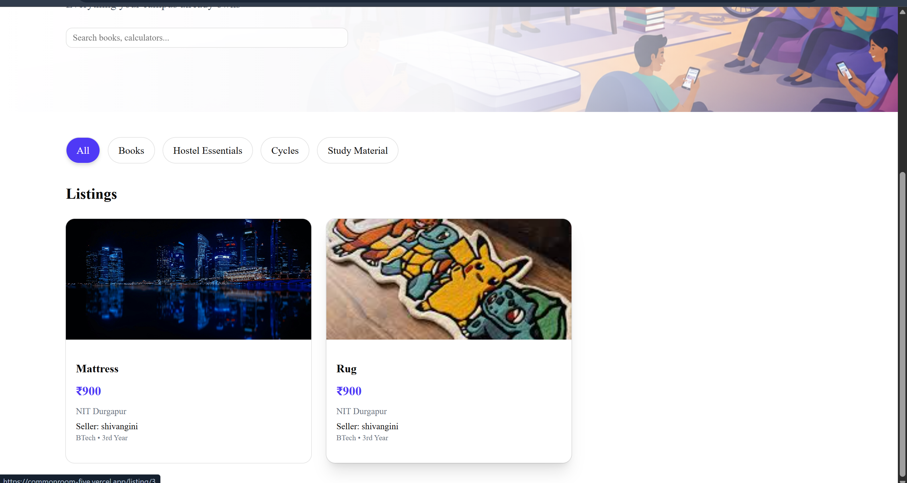
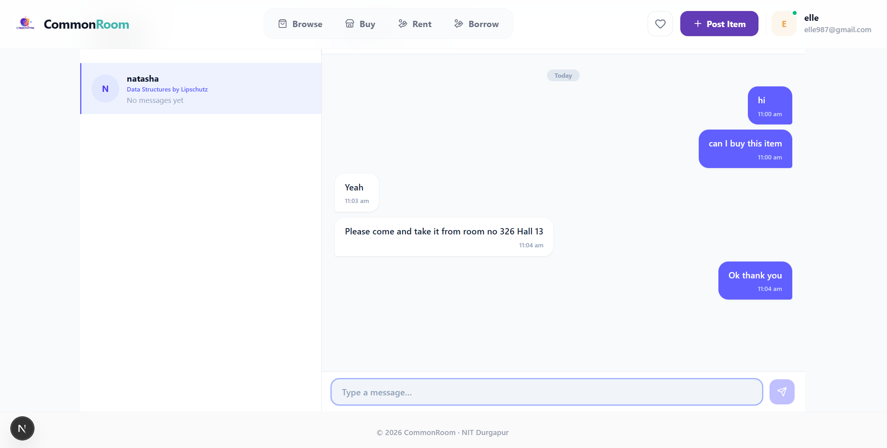
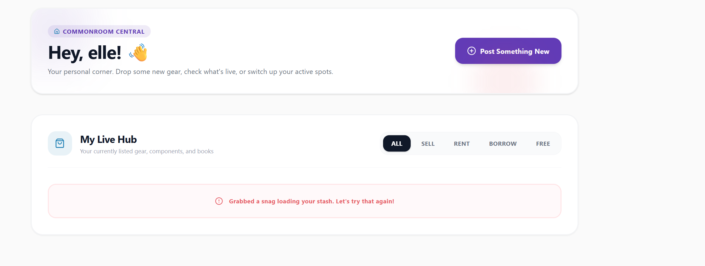

# CommonRoom

A full-stack, real-time campus marketplace built for university students to easily buy, sell, rent, and borrow items. 

🔗 **Live Application:** [commonroom-five.vercel.app](https://commonroom-five.vercel.app) *(Note: Backend cold-start may take ~30s on the free tier)*

## Previews






---

## Technical Overview

CommonRoom is engineered to handle real-world challenges like secure authentication, real-time bidirectional communication, and scalable database querying.

### Tech Stack
- **Frontend:** Next.js, React, TypeScript, Tailwind CSS, shadcn/ui
- **Backend:** Django, Django REST Framework
- **Real-Time Engine:** Django Channels, WebSockets, Daphne (ASGI)
- **Database:** PostgreSQL
- **Media Storage:** Cloudinary CDN

### Core Capabilities
- **Secure Authentication:** Implemented JWT-based authentication featuring silent automatic token refresh using Axios interceptors.
- **Real-Time Messaging:** Built a live in-app chat system utilizing WebSockets, protected by query-string JWT validation.
- **Server-Side Search & Filtering:** Optimized performance by resolving all search and category filters at the database level with indexed fields, completely avoiding inefficient client-side data filtering.
- **Robust Media Handling:** Integrated Cloudinary for all image uploads to ensure persistence and decoupling from ephemeral server storage environments.
- **Data Protection:** Enforced strict ownership-based authorization controls (HTTP 403) across all modification and deletion endpoints.
- **Efficient Data Loading:** Utilized cursor-based and offset pagination strategies, along with pre-fetching techniques to eliminate N+1 query problems.

---

## Local Setup

### Backend (Django)

```bash
cd commonroom-backend
python -m venv venv
# Activate the virtual environment
# Windows: venv\Scripts\activate
# Mac/Linux: source venv/bin/activate

pip install -r requirements.txt
```

Create a `.env` file in the `commonroom-backend` directory with the required environment variables (Database credentials, Cloudinary API keys, and Django Secret Key).

```bash
python manage.py migrate
python manage.py runserver 
```

### Frontend (Next.js)

```bash
cd commonroom
npm install
npm run dev
```

Create a `.env.local` file in the Next.js root:
```env
NEXT_PUBLIC_API_URL=http://127.0.0.1:8000/api
NEXT_PUBLIC_BACKEND_URL=http://127.0.0.1:8000
```
