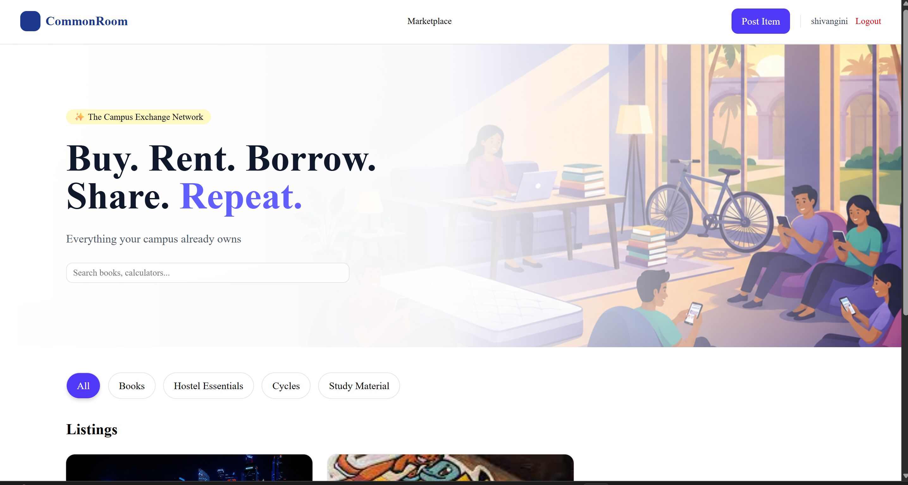

# CommonRoom

A peer-to-peer campus marketplace for NIT Durgapur students to **buy, sell, rent, and borrow** items — books, cycles, hostel essentials, and more.

🔗 **Live:** [commonroom-five.vercel.app](https://commonroom-five.vercel.app)



---

## Tech Stack

| | |
|---|---|
| **Frontend** | Next.js, TypeScript, Tailwind CSS |
| **Backend** | Django 6, Django REST Framework |
| **Real-time** | Django Channels + WebSockets (Daphne ASGI) |
| **Auth** | JWT — `djangorestframework-simplejwt` |
| **Database** | PostgreSQL |
| **Media** | Cloudinary CDN |
| **Deployed on** | Vercel (frontend) · Render (backend) |

---

## Features

- **JWT Auth** — Register/login with 1-hour access tokens and 7-day refresh tokens. An Axios interceptor silently refreshes tokens on any 401 — users are never unexpectedly logged out.
- **Real-time Chat** — WebSocket-based in-app messaging between buyers and sellers. REST loads message history; WebSocket handles live delivery. JWT authenticated via query string (standard Channels pattern).
- **Server-side Search & Filtering** — Debounced queries hit the Django API; filtering uses `icontains` on a `db_index`-ed field. Never fetches all records client-side.
- **Cloudinary Image Upload** — Images go directly to Cloudinary CDN on POST, not to the server filesystem, making the app redeploy-safe on Render's ephemeral storage.
- **Ownership Guards** — Edit/delete endpoints return 403 if the requester isn't the listing owner. WebSocket connections reject unauthorized participants with a close code.
- **Favorites / Wishlist** — Toggle-favorite endpoint uses `get_or_create` (no duplicate rows). Favorite IDs pre-fetched in a single query to avoid N+1 on list pages.
- **Pagination** — 9 listings per page; backend returns `count`, `next`, `previous`, `results` following DRF conventions.

---

## API Reference

| Method | Endpoint | Auth | Description |
|---|---|---|---|
| `POST` | `/api/auth/register/` | — | Create account |
| `POST` | `/api/auth/login/` | — | Login, returns JWT pair |
| `POST` | `/api/auth/token/refresh/` | — | Refresh access token |
| `GET` | `/api/listings/` | — | Browse listings (`?search=&category=&page=`) |
| `POST` | `/api/listings/` | ✓ | Create listing + Cloudinary upload |
| `PATCH` | `/api/listings/<id>/` | ✓ owner | Update listing |
| `DELETE` | `/api/listings/<id>/` | ✓ owner | Delete listing |
| `POST` | `/api/listings/<id>/favorite/` | ✓ | Toggle favorite |
| `POST` | `/api/chat/conversations/start/` | ✓ | Get or create a conversation (idempotent) |
| `GET` | `/api/chat/conversations/` | ✓ | List user's conversations |
| `GET` | `/api/chat/conversations/<id>/messages/` | ✓ | Paginated message history |
| `WS` | `ws/.../ws/chat/<id>/?token=` | ✓ JWT | Real-time message stream |

---

## Running Locally

**Backend**
```bash
cd commonroom-backend
python -m venv venv
venv\Scripts\activate        # Mac/Linux: source venv/bin/activate
pip install -r requirements.txt
```

Create `commonroom-backend/.env`:
```
SECRET_KEY=your_secret_key
DEBUG=True
DB_NAME=commonroom
DB_USER=postgres
DB_PASSWORD=your_password
DB_HOST=localhost
DB_PORT=5432
CLOUDINARY_CLOUD_NAME=...
CLOUDINARY_API_KEY=...
CLOUDINARY_API_SECRET=...
```

```bash
python manage.py migrate
python manage.py runserver   # Daphne ASGI server — handles both HTTP and WS
```

**Frontend**
```bash
cd commonroom
npm install
npm run dev
```

---

## A Few Engineering Decisions Worth Mentioning

**Why WebSocket auth via query string?**
The browser WebSocket API doesn't support custom headers on the initial handshake. Passing the JWT as `?token=` is the standard Django Channels pattern. The token is validated and the user's participant status is checked *before* the socket is accepted — unauthorized clients get close code 4001/4003.

**Why InMemoryChannelLayer (not Redis) locally?**
For a single-server deployment, InMemoryChannelLayer works perfectly and requires zero infrastructure setup. Switching to Redis in production is a one-line config change — the consumer code doesn't change at all.

**Why server-side search over client-side filtering?**
Client-side filtering requires fetching the entire dataset upfront. With `title__icontains` and a `db_index`, the database does the heavy lifting and the query stays fast as the dataset grows.

**Why Cloudinary over Django's `ImageField`?**
Render (and most PaaS) use ephemeral filesystems — uploads are wiped on redeploy. Cloudinary decouples media from the server entirely.

---

> The Render backend is on the free tier and may take ~30 seconds to cold-start after inactivity.
